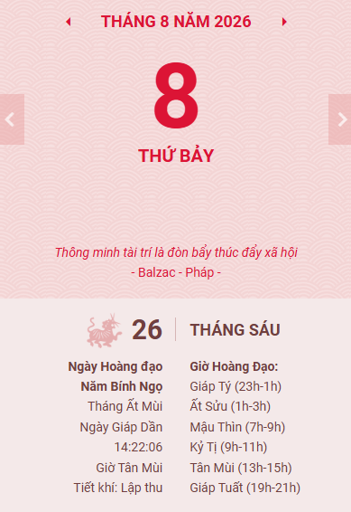

# P0 Khai trương Thư Quán 360

*2026-08-08*

> Đôi lời nhân dịp khai trương Thư Quán 360.

## Đôi lời gửi bạn đọc

*Nhân ngày khai trương Thư Quán 360, 8/8/2026*

---

Mến chào anh chị em cộng đồng 360 Trading Academy cùng các bạn đọc thân hữu,

Mình (David Nguyen) là người học kỹ thuật, làm kỹ thuật từ lúc ra trường đến nay (2026) cũng gần 12 năm, không và cũng chưa làm bất cứ công việc nào liên quan tới tài chính. Suốt thời gian từ hồi còn đi học và đi làm, mối quan tâm duy nhất của mình hầu như là vấn đề chuyên môn. Đâu đó năm 2016, mình cũng có tập tành mở tài khoản chứng khoán, cũng thử mua mua bán bán để kiếm lời cho biết. Kiếm được lời thì ngon, nhưng cũng không đi tới đâu, may mắn là vẫn chưa bị lỗ sấp mặt. Từ đó, mình kết luận trò này (trading) là game đánh bạc. Nên không đọc hay tìm hiểu gì về đầu tư, trading hay tài chính. Cuối tháng lãnh đủ lương là được :confused:

Nhưng...

## Ai đã đưa tui đến trading?

Năm 2022, nhân dịp đi "nhậu", gặp lại ông bạn học từ cấp 3, đã chạy xe gần 100km về chỉ để hai thằng lai rai vài lon bia. Chuyện thì ôi thôi không nhớ nổi, chủ yếu là nào lấy vợ, nếu dư tiền làm gì, còn tính nếu rảnh rảnh đăng ký học cao học Toán cho đỡ nhớ nghề... bla bla... Rồi dẫn đến chuyện ông bạn mình gap-year một năm.

Ông bạn mình là một dân chuyên Toán, một học sinh giỏi cấp Quốc gia, một Phó khoa bệnh viện lớn, vậy mà sẵn sàng gap-year một năm, về bên phố biển Nha Trang chỉ để toàn tâm đọc, thực hành, kiểm chứng các kiến thức về giao dịch. Đó là quá trình đấu tranh giữa lòng tham cá nhân khi thăng hoa, sự sợ hãi, sự thiếu thốn hiểu biết và trải nghiệm khi giao dịch có thể đẩy tâm trí và túi tiền đến những hoàn cảnh cực đoan. Đấy là lần đầu tiên mình thấy việc học và trade nó khắc nghiệt, nghiêm túc ra sao, và cái giá về tiền bạc, thời gian, sức khỏe tâm lý phải trả ra sao để có được sự thuần thục trong kỹ năng giao dịch, chứ không dễ dãi như mình ngày trước.

Buổi nhậu dài hai tiếng kết thúc với vài lon bia, kha khá mồi, và một ý nghĩ mơ hồ: có thể đây là một lĩnh vực cần được khai phá...

Những năm 2022-2025 là khoảng thời gian mình tự tìm hiểu thị trường tài chính và cách giao dịch, nhưng kết quả cũng không khả quan lắm. Việc tự tìm hiểu mà không có người chỉ dẫn đúng hướng nó cực ghê gớm. Kết luận: chắc không có duyên với món này :smile:, nhưng may là chưa bỏ.

Bước ngoặt đến vào cuối năm 2025, khi mình gặp được cô Hổ chủ nhiệm. Các loạt bài đầu tiên của cô khai thị không phải về cách trade, mà là về việc thị trường vận hành ra sao, nên chọn sản phẩm nào để giao dịch phù hợp với bản thân,... đã giúp mình thay đổi hoàn toàn cách hiểu thị trường. Sau đó mình tham gia cộng đồng 360 tại Discord, nơi có rất nhiều anh chị em cùng chung mục tiêu: hoàn thiện kỹ năng trading.

Kiến thức từ các anh chị em trong cộng đồng thật sự quá hay và quá nhiều. Mình thì tuổi đã cao (3x), nên phải làm cái gì có thể lưu giữ được tri thức, vừa giúp mình hệ thống được kiến thức cho dễ đọc dễ hiểu, vừa có thể đem lại hữu ích cho các anh chị em nếu cần. Đó là lý do website này ra đời (nói gọn là: do già cả :joy: không nhớ được nhiều nên phải viết ra hehe). Cái tên "Thư Quán 360" cũng từ đây mà ra.

## Trang này sẽ có gì?

Đơn giản là mình sẽ:

- **Ghi lại những gì học được**: đọc sách, báo cáo, học từ người đi trước, rồi viết lại theo cách dễ hiểu nhất, với số liệu, mô hình, kiểm chứng, thay vì cảm tính, hệ tâm linh, bình dân học vụ abc mà.
- **Hệ thống lại các bài viết, kinh nghiệm của các anh chị em 360**: lưu trữ các bài viết public hoặc được cho phép chia sẻ từ các anh chị em trong cộng đồng 360.
- **Các tản mạn cuộc sống**: cuộc sống không chỉ có trading. Một kỹ năng trading tốt góp phần đảm bảo sức khỏe tài chính, nhưng qua quá trình trading đó, còn là quá trình làm chủ cảm xúc, tâm trí, biết đâu là điểm dừng,... từ đó kiến tạo một sức khỏe tâm trí an lành. Đó là một trong hai mục tiêu mình hướng tới: **Tài chính thịnh vượng + Tâm trí an lành**.

Trang này sẽ không có "công thức làm giàu" hay "chén thánh". Đơn giản, đây là nơi mình muốn lưu trữ và sắp xếp các kiến thức nền tảng về thị trường tài chính, các sản phẩm tài chính, cách giao dịch và vận dụng, nhờ đó hiểu rõ bản chất trước khi làm, hiểu rủi ro trước khi xuống tiền.

## Lời cảm ơn :heart:

Cảm ơn cộng đồng 360 đã cho mình động lực để bắt tay làm chuyện này.

Cảm ơn cô Hổ chủ nhiệm (TA-Police) vì các kiến thức khai thị về thị trường, giúp mình hiểu hoàn toàn khác về cách thị trường vận hành. 

Cảm ơn chị Quỳnh (FP-Queen) và chú Sang (OB-Prince) vì các khóa workshop cực kỳ hữu ích. 

Cảm ơn thầy Tuấn (MP-King) vì đã sáng lập ra cộng đồng 360 với các kỹ thuật Market Profile hữu ích, cùng cô Mỹ Hà qua các buổi live trade từ sáng sớm tinh mơ. Và cảm ơn các bạn đang đọc những dòng đầu tiên này, dù tình cờ ghé qua hay đã theo dõi từ trước, có người đọc là vui rồi.

Các bài viết sẽ được viết cẩn thận và thẩm định nội dung tốt nhất có thể trong hiểu biết của mình, cập nhật khi có thay đổi. Không thổi phồng, không vẽ giấc mơ làm giàu nhanh, chỉ có kiến thức thật, đã kiểm chứng, dễ hiểu.

Mong các bạn đọc tìm được giá trị hữu ích từ Thư Quán 360. Trân trọng :heart:!

***Thư Quán 360 tự hào là một thành viên của cộng đồng 360!***

— *Kuala Lumpur, 08/08/2026*

 *David Nguyen*

---

*"Hành trình vạn dặm bắt đầu từ bước đi đầu tiên"*

